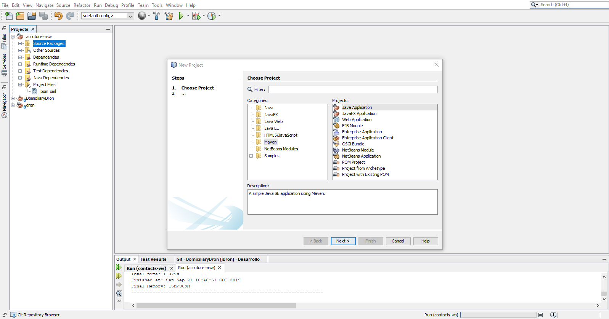
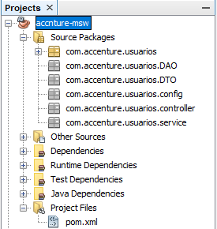
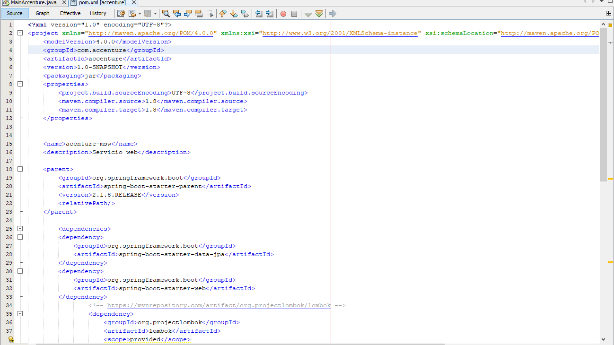
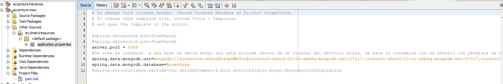
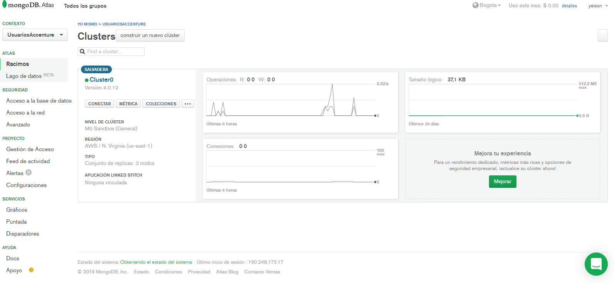

# Aplicaión micro servicios
Aplicación desarrollada para mostrar la construcción básica de un micro servicio usando spring 

##  Herramientas usadas
* [Java 8](https://www.oracle.com/technetwork/java/javase/downloads/jdk8-downloads-2133151.html)
* [netBeans](https://netbeans.org/downloads/8.2/)  
* [Spring web](https://mvnrepository.com/artifact/org.springframework/spring-web) 
* [Spring test](https://mvnrepository.com/artifact/org.springframework.boot/spring-boot-starter-test) 
* [Spring mongodb](https://spring.io/projects/spring-data-mongodb) 
* [loombook](https://projectlombok.org/) 
* [dozer](https://www.arquitecturajava.com/javabeans-dto-y-dozer/) 
* [log4j](https://logging.apache.org/log4j/2.x/) 

## Pasos para crear la aplicación

1. Se crea el proyecto usando maven

 

2. Definimos los paquetes básicos que vamos a usar en la aplicación

3. DEfinimos el archivo pom

4. Definimos el archivo application.properties y el puerto por sel cual se desea comunicar la aplicación

5.Definimos nuetra clase inicial del proyecto 

6. Creamos una base de datos mongodb usando el proveedor de servicio [atlas](https://cutt.ly/jwMx5IT) el cual nos permite tener una base de datos disponble 24/7

7. Realizamos la conexion en el archivo application.properties 
